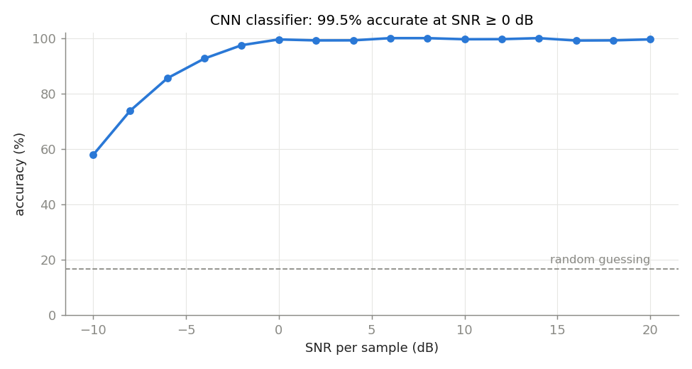
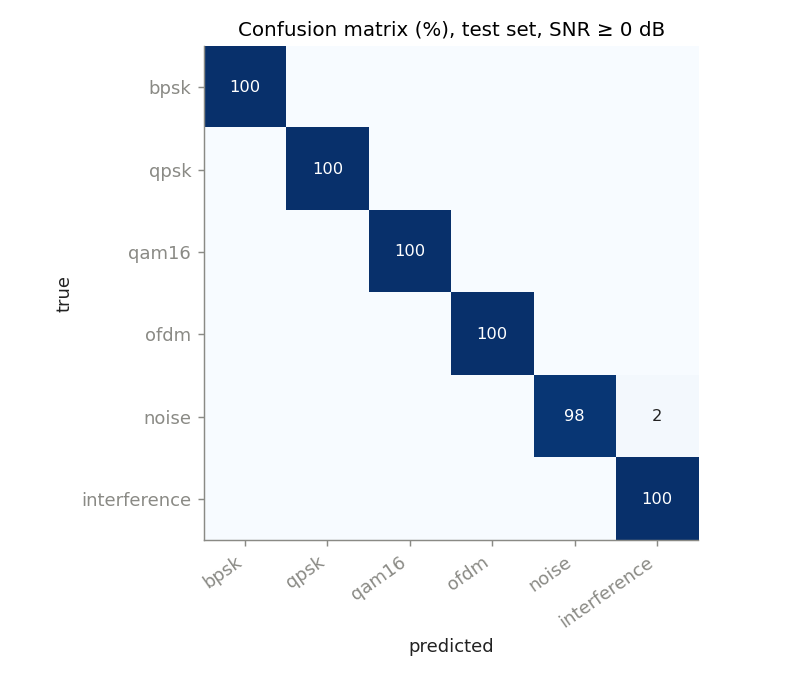
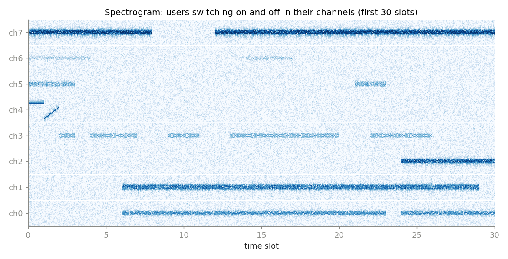
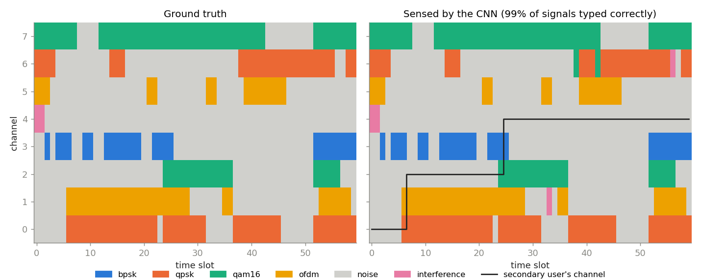
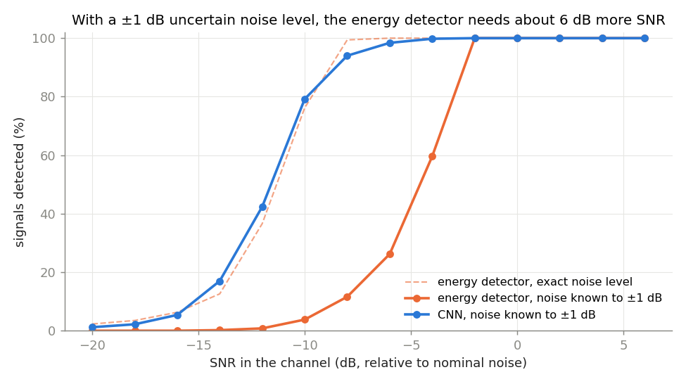
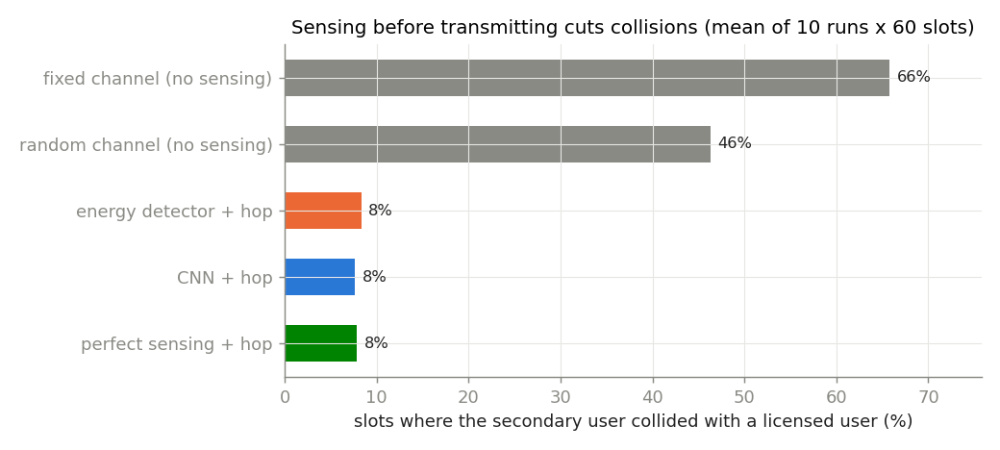
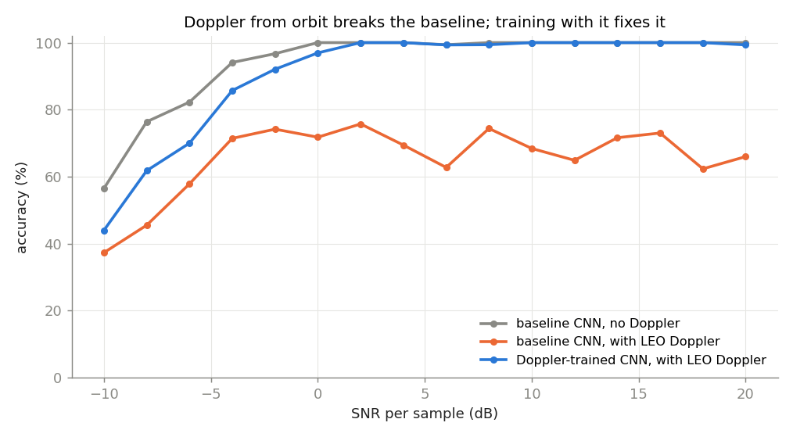
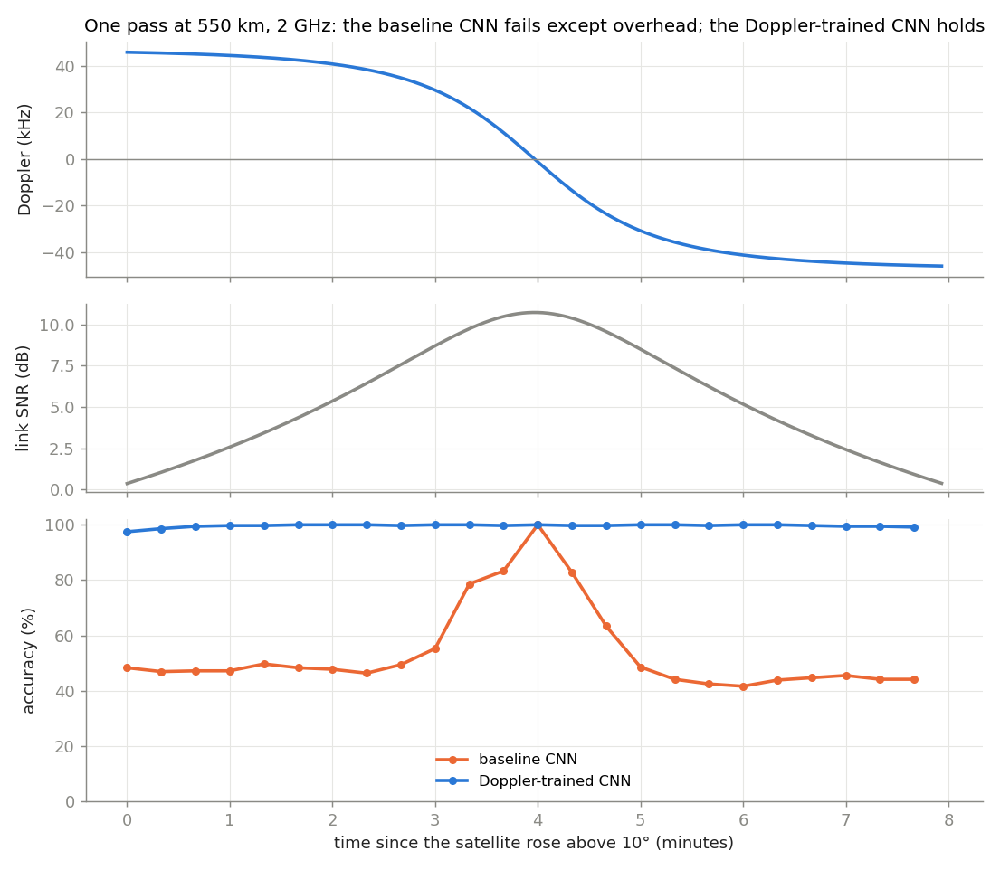
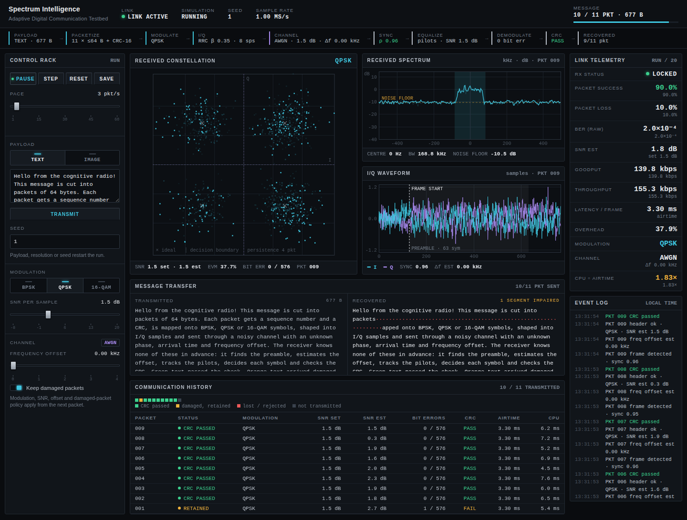

# AI-Based Cognitive Radio Spectrum Intelligence

A simulated cognitive radio that **senses an 8-channel band, recognises what is in
each channel with a CNN, and picks a free channel to transmit on**, then tests the
same system **from a LEO satellite**, where orbital Doppler breaks a normally trained
classifier and Doppler-aware training fixes it.

```
I/Q samples → spectrum & spectrogram → channelizer → detection → CNN classifier → occupancy map → channel choice
                                                                              ↘ LEO extension: Doppler + path loss
```

## Results at a glance

| Experiment | Result |
|---|---|
| Classify 6 signal types (BPSK, QPSK, 16-QAM, OFDM, noise, interference) from raw I/Q | **99.5%** accuracy at SNR ≥ 0 dB, 94.4% over −10 to +20 dB (unseen test set) |
| Detect a signal in a channel, noise level known exactly | Energy detector and CNN equal: 90% detection at −8 dB SNR |
| Same, with the noise level uncertain by ±1 dB (realistic) | CNN still detects at −8 dB; energy detector needs −2 dB (**6 dB worse**) or raises 33% false alarms |
| Full 8-channel system, 10 runs × 60 slots | CNN names the signal in **98.8%** of busy channel-slots; sensing cuts collisions from 46–66% to **≈ 8%** |
| Same CNN on a satellite at 550 km, 2 GHz (Doppler up to ±46 kHz) | Drops to **69%** at SNR ≥ 0 dB |
| CNN trained with Doppler augmentation | Back to **99.5%** with Doppler, stays above 97% for the whole 8-minute pass |

<table>
<tr><td></td><td></td></tr>
<tr><td></td><td></td></tr>
<tr><td></td><td></td></tr>
<tr><td></td><td></td></tr>
</table>

All numbers are in [`results/metrics.json`](results/metrics.json).

## End-to-end communication link (upgrade in progress)

The project is being extended from spectrum *analysis* into a full communication system:
information → bits → packets → modulation → I/Q → channel → receiver → information.

**Phase 1 (done): text over an AWGN link.** The receiver knows nothing in advance except the
preamble and pilots. It finds the frame, the symbol timing, the frequency offset, the phase and
the SNR from the received samples alone.

| Measured (100 frames per point, AWGN, random phase and arrival time) | BPSK | QPSK | 16-QAM |
|---|---|---|---|
| Loss vs textbook theory at BER 10⁻³ | 0.2 dB | 0.3 dB | 0.6 dB |
| SNR per sample for ≥ 90% of 64-byte packets to pass CRC | −1 dB | 3 dB | 10 dB |

- Frame: 63-symbol m-sequence preamble, 32-bit BPSK PHY header (modulation, length, CRC-16),
  payload, one pilot every 16 symbols. Packets: sequence number, length, CRC-16; losses are reported, never hidden.
- Receiver: matched filter → segmented preamble correlation (timing + frame sync, robust to frequency offset;
  threshold set from measured noise statistics) → multi-lag frequency estimate refined by the pilot phase slope →
  pilot-based gain/phase tracking → demapping → CRC. Optional coarse frequency search handles LEO-scale Doppler.

**Phase 2 (done): images.** Images are sent as raw 8-bit pixels (a compressed file breaks with one bit error).
Same channel, two receiver policies: *strict* drops packets that fail the CRC; *error-tolerant* keeps a damaged
packet if its header is self-consistent (CRC-valid packets always take priority).

| Measured (64×64 RGB, 193 packets, 2 trials per point) | BPSK | QPSK | 16-QAM |
|---|---|---|---|
| SNR for image PSNR ≥ 30 dB, error-tolerant | 0 dB | 2 dB | 10 dB |
| SNR for image PSNR ≥ 30 dB, strict | 2 dB | 4 dB | 12 dB |
| Mean PSNR gain of error-tolerant mode where packets were lost | +10.5 dB | +9.4 dB | +5.7 dB |
| SNR where the compressed PNG always decodes | 2 dB | 6 dB | 12 dB |

**Phase 3 (done): link metrics.** One scorecard for every transmission: frame detection, header success,
packet success/error rate, BER, SER, PHY rate, throughput, goodput (useful bits that arrived intact),
spectral efficiency, overhead and airtime latency (default 1 MS/s → 125 kBd, 168.75 kHz occupied bandwidth).

| Measured (64-byte packets, 24 packets × 2 trials per point) | BPSK | QPSK | 16-QAM |
|---|---|---|---|
| Peak goodput | 89 kbps | 155 kbps | 247 kbps |
| Overhead (preamble + headers + pilots + CRC) | 29% | 38% | 51% |
| Airtime per frame | 5.7 ms | 3.3 ms | 2.1 ms |
| SNR for packet error rate < 10% | 0 dB | 3 dB | 10 dB |
| SNR range where it gives the highest goodput | below 1 dB | 1–8 dB | 9 dB and above |

- The best modulation changes with SNR (switch points 1 dB and 9 dB): the basis for adaptive modulation.
- Packet size is a trade-off: small packets survive noise, large packets waste less on overhead
  (16 B: 69% overhead, 1024 B: 9%). Best goodput: 16 B at ≤ 0 dB, 64 B at 1 dB, 256 B at 2–4 dB, 1024 B at ≥ 5 dB (QPSK).
- The original CNN, never trained on these frames, recognises the link's own modulation from a 1024-sample
  payload window: 100% / 99.2% / 99.7% (BPSK / QPSK / 16-QAM) at SNR ≥ 0 dB.

**Phase 4 (done): live dashboard.** A local web page (Python standard library only, no internet needed)
styled as a dark RF test-bench shows the link working packet by packet: the TX → channel → RX pipeline with live
values at each stage, the received constellation (with decision boundaries and EVM), spectrum (with occupied band
and noise floor), I/Q waveform (with the detected frame start), link telemetry, a packet-by-packet event log,
transmitted vs recovered message, and the packet history. Modulation, SNR, frequency offset and error-tolerant
mode can be changed while it runs; "Save run" writes a new results folder.



- The real-time engine runs the same per-packet code as the experiments; for the same seed it gives
  bit-identical packets and received bytes (checked by tests and by the experiment).
- Profiling showed ~60% of the time per packet went into recomputing the same pulse-shaping filter.
  Computing it once changed no output (regression check: 0 difference) and made each packet 2.4× faster
  (2.3–3.0× across runs on this machine).

| Measured (median of 40 packets, 1 MS/s, 2-core cloud CPU; rerun on yours) | BPSK | QPSK | 16-QAM |
|---|---|---|---|
| CPU time ÷ airtime, 64-byte packets, before → after | 1.7 → 0.99 | 2.5 → 1.03 | 3.7 → 1.45 |
| CPU time ÷ airtime after, 16 / 64 / 256 / 1024 B | 1.23 / 0.99 / 0.75 / 0.92 | 1.48 / 1.03 / 0.78 / 0.87 | 1.96 / 1.45 / 1.20 / 1.05 |

Below 1 the link is processed faster than it is transmitted. The remaining time is mostly frame sync
(seven full-length correlations per burst).

Found with the dashboard: in error-tolerant mode a bit error in a packet's *sequence number* files the data
under the wrong slot (seed 1, QPSK, 1.5 dB: packet 1 is read as packet 9, so slot 1 stays empty). The MAC header
is only protected by the packet CRC, which tolerant mode ignores; protecting the header separately is a
candidate for the error-correction phase. The dashboard is a single-user local tool, not a multi-user web app.

```bash
python scripts/dashboard.py                                                    # opens http://127.0.0.1:8765
python scripts/dashboard.py --source image --snr 3                            # the sample photo
python scripts/exp_realtime.py                                                 # speed before/after (~20 s)
python scripts/exp_link_metrics.py                                             # scorecard sweep (~1.5 min)
python scripts/demo_image_link.py --snr 2                                      # original vs strict vs tolerant vs PNG
python scripts/exp_image_link.py                                               # PSNR/SSIM vs SNR sweep (~3 min)
python scripts/demo_text_link.py --text "Hello satellite" --mod qpsk --snr 3   # every stage, printed + figure
python scripts/exp_link_ber.py                                                 # BER/SER/packet success vs SNR
python scripts/check_regression.py                                             # original results unchanged?
```
New experiment runs are saved under `results/experiments/<name>/<time>-seed<N>/` and are never overwritten.
The original validated numbers are frozen in `results/validated/metrics_v1.json`.

## How it works

1. **Signals** (`signals.py`): BPSK, QPSK and 16-QAM with root-raised-cosine pulse shaping
   (8 samples/symbol, β = 0.35); OFDM with 20 QPSK subcarriers, 128-point FFT and cyclic prefix;
   receiver noise; CW-tone or chirp interference. Random carrier phase and timing, AWGN at a chosen SNR.
2. **Band** (`spectrum.py`): eight channels side by side at 8× the channel rate. A channelizer
   (shift → root-raised-cosine low-pass → decimate) returns each channel in exactly the
   classifier's input format; its filter keeps channelised noise white.
   The noise floor is estimated from the median of the spectrum.
3. **Detection** (`detector.py`): energy detector with a Neyman–Pearson threshold for a
   1% false-alarm rate, compared with the CNN ("occupied" = top class is not noise).
4. **Classification** (`classifier.py`): 1-D CNN on the 2 × 1024 I/Q array
   (4 conv blocks, global average pooling, 110k parameters), trained on 15,000 examples
   from −10 to +20 dB, tested on a separate seed.
5. **Cognitive layer** (`occupancy.py`): licensed users switch on/off as Markov chains;
   the secondary user senses in slot *t* and transmits in slot *t + 1*, staying put while
   its channel is free and otherwise hopping to the free channel idle the longest.
6. **LEO** (`leo.py`): overhead pass at 550 km (7.59 km/s, ~8 min above 10°), Doppler
   f_D = −f_c·ṙ/c, free-space path loss 153–164 dB, link budget giving 0–11 dB SNR in 1 MHz.

## Project layout
```
spectrum_intel/   dsp, signals, dataset, spectrum, detector, classifier, occupancy, leo, plots
                  payload, coding, packet, modulation, transmitter, channel, receiver, link,
                  metrics, experiments, engine, dashboard (+ web/dashboard.html)   (communication link)
scripts/          train_classifier, evaluate_detection, run_spectrum_demo, run_leo_experiment,
                  preview_signals, run_all, demo_text_link, exp_link_ber, check_regression,
                  demo_image_link, exp_image_link, exp_link_metrics,
                  dashboard, exp_realtime
models/           cnn_baseline.pt, cnn_doppler.pt  (trained weights, 455 KB each)
docs/             dashboard screenshot
results/          figures + metrics.json (validated), validated/ (frozen copy), experiments/ (new runs)
tests/            134 automated checks
```

## Setup and run (macOS)
```bash
python3 -m venv .venv
source .venv/bin/activate
pip install -r requirements.txt

python -m pytest                    # 134 checks
python scripts/run_all.py           # every experiment with the saved models (~3 min)
python scripts/run_all.py --retrain # retrain both CNNs too (~20 min CPU, faster on Apple GPU)
```

## Limitations and next steps
Simulated signals only; channel effects limited to AWGN, phase, timing and Doppler;
fixed 8-channel grid; simplified orbit (directly overhead, no Earth rotation).
Next: real captures with an RTL-SDR or the RadioML 2018 dataset, multipath fading,
open-set "unknown signal" detection, spectrogram object detection for signals of any
width, and SGP4 orbits with real satellite elements.
